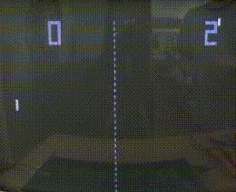

# Aplicaciones interactivas

Dentro del conjunto de facilidades que provee *P5.js* se encuentran funciones y variables para registrar los eventos producidos por la interacción externa, desde aceleración y rotación de dispositivos móviles, detección de toque y arrastre sobre pantallas táctiles, hasta los simples movimientos de mouse y presión de teclas del teclado [Referencia](https://p5js.org/reference/#Events).

Los videojuegos son las aplicaciones interactivas por excelencia, y suelen ser muy buenos disparadores para motivar estudiantes a resolver nuevos desafíos. Vamos a desarrollar un pequeño juego interactivo usando algunas de las ideas que ya vimos.

[Pong](https://es.wikipedia.org/wiki/Pong): es un videojuego de consolas de primera generación, publicado por Atari en 1972. Pong fue el primer videojuego con éxito comercial.

<!-- La idea del juego es muy simple: dos jugadores controlan paletas y deben tratar de atajar/golpear la pelota evitando que esta toque el limite de la cancha que está a sus espaldas; si la pelota toca el limite que está detrás de la paleta, el contrario anota un punto.-->



-------------------------------------------------------------------------------

## Definiendo el área de juego

Para comenzar definamos el tamaño de nuestra cancha como una constante `const courtSize`, crearemos el canvas utilizándola y luego dibujaremos la red con la función `dibujarRed()`.

<iframe src="https://editor.p5js.org/gastonscilingoDC/sketches/WEus676AV" width="600" height="600"></iframe>


## Representando los objetos móviles


Nuestro juego contará de tres objetos móviles, la pelotita y las dos paletas. Intentaremos imitar la estética retro pixelada del juego original. La pelotita será un simple cuadrado y las paletas dos rectángulos por el momento. Definiremos objetos `javascript` para representar nuestros objetos del juego y utilizaremos la función `rect()` de *p5.js* para dibujarlos.

TBC

<iframe src="https://editor.p5js.org/gastonscilingoDC/full/3GwhDf4Gq" width="600" height="600">></iframe>

## Dando movimiento a las paletas

En este juego, el jugador controlará ambas paletas utilizando el teclado. La paleta derecha se moverá con las teclas de flecha  &uarr; y  &darr;, mientras que la paleta izquierda se manipulará con las teclas `a` (arriba) y `z` (abajo). Para lograr esto, *p5.js* nos ofrece varias funciones y variables que facilitan la gestión de eventos del teclado, como `keyPressed()`, `key` y `keyCode`, las cuales permiten detectar y manejar las entradas del usuario através del teclado.

```js

function keyPressed() {
  if (key === 'a') {
    // Código a ejecutar si se presiona la letra a
  }

  if (keyCode === ENTER) {
    // Código a ejecutar sis e presiona un enter
  }
}


```


* `keyPressed()` es una función que se ejecuta automáticamente cuando el usuario presiona cualquier tecla del teclado. Es útil para capturar cuándo una tecla ha sido presionada y realizar acciones en consecuencia.

* `key` es variable global de *p5.js* que almacena el valor de la tecla presionada más recientemente. `key` no se actualiza cuando se trata de caracteres especiales como `LEFT_ARROW` y `ENTER`. En estos casos utilizamos la variable `keyCode`. `keyCode es una variable global que almacena el código ASCII de la última tecla presionada. 

> Las variables `BACKSPACE`, `DELETE`, `ENTER`, `RETURN`, `TAB`, `ESCAPE`, `SHIFT`, `CONTROL`, `OPTION`, `ALT`, `UP_ARROW`, `DOWN_ARROW`, `LEFT_ARROW` y `RIGHT_ARROW` 
> son constantes útiles definidas por *p5.js* para los caracteres especiales.


Lo hacemos?


<iframe src="https://editor.p5js.org/valebengolea/sketches/g7YxCkDCH" width="600" height="600"></iframe>


> [!TIP|label:NOTA]
> Link para abrir este editor en otra ventana del navegador [Moviendo las paletas](https://editor.p5js.org/valebengolea/sketches/g7YxCkDCH)


## Versión final

TBD

<iframe src="https://editor.p5js.org/gastonscilingoDC/full/LPdkOm2zq" width="600" height="600"></iframe> 
